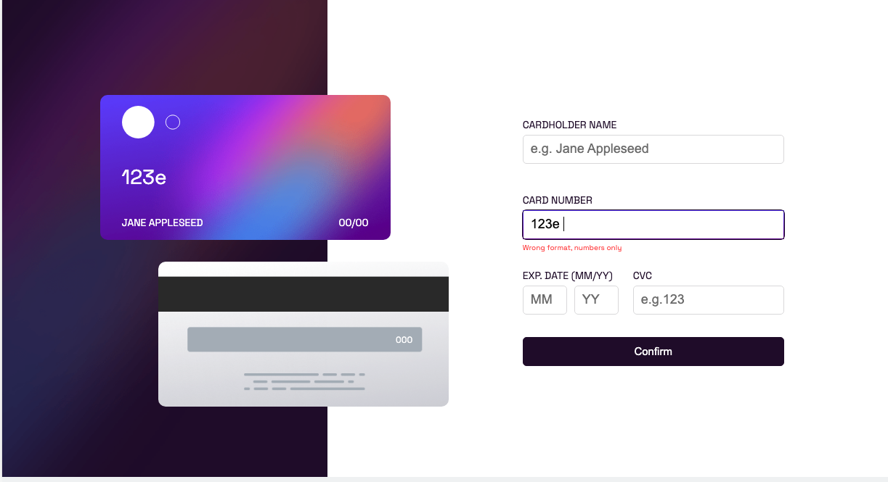

# Frontend Mentor - Interactive card details form solution

This is a solution to the [Interactive card details form challenge on Frontend Mentor](https://www.frontendmentor.io/challenges/interactive-card-details-form-XpS8cKZDWw). Frontend Mentor challenges help you improve your coding skills by building realistic projects.

## Table of contents

- [Frontend Mentor - Interactive card details form solution](#frontend-mentor---interactive-card-details-form-solution)
  - [Table of contents](#table-of-contents)
  - [Overview](#overview)
    - [The challenge](#the-challenge)
    - [Screenshot](#screenshot)
    - [Links](#links)
  - [My process](#my-process)
    - [Built with](#built-with)
    - [What I learned](#what-i-learned)
    - [Continued development](#continued-development)
    - [Useful resources](#useful-resources)
  - [Author](#author)

**Note: Delete this note and update the table of contents based on what sections you keep.**

## Overview

### The challenge

Users should be able to:

- Fill in the form and see the card details update in real-time
- Receive error messages when the form is submitted if:
  - Any input field is empty
  - The card number, expiry date, or CVC fields are in the wrong format
- View the optimal layout depending on their device's screen size
- See hover, active, and focus states for interactive elements on the page

### Screenshot




### Links

- Solution URL: [Add solution URL here](https://your-solution-url.com)
- Live Site URL: [Add live site URL here](https://your-live-site-url.com)

## My process

### Built with

- Semantic HTML5 markup
- CSS custom properties
- Flexbox
- CSS Grid
- Typescript

### What I learned

Throught this project many aha moments were learned. Starting with using Typescript, it was a great learning experience. Type casting was quite a challenge trying to figure out what to use when adding the envents listeners to the elements. I am very happy with the result, even though am only using an image as reference it was very helpful.

Take away moments:
* Accessing properties from the object had to be manipulated many times to get the correct value, ` const target = e.target as HTMLInputElement; `
* On the next project my idea is to use rems instead of px for the font sizes, but I am not sure if it will work on all devices.
* On the CSS department feels I am having a better control of the propoerties using the BEM methodology.
```css
.label-wrapper {
                @include flex(column, flex-start, flex-start);
                padding: 0px 10px 0 10px;

                label {
                    font-size: 14px;
                    color: $very-dark-violet;
                    margin: 0 0 5px 0;

                }

                input {
                    height: 40px;
                    border: 1px solid $light-grayish-violet;
                    border-radius: 5px;
                    padding: 0 10px;
                    font-size: 18px;

                    &:focus {
                        outline: 1px solid $very-dark-violet;
                        border-image-source: $liner-gradient-active-input;
                        border-width: 1px;
                        border-image-slice: 1;
                        border-radius: 5px !important;
                    }
                }
```

* Trying to keep up my Typescript knowledge, I had to use the ` as HTMLInputElement ` to access the properties of the element.
```typescript
 ccNumber.addEventListener('keydown', function (e) {
    const target = e.target as HTMLInputElement;
    if (target.value.length === 4) {
        target.value = target.value + ' ';
    }
```
* The event coming downn from the callback function was a bit tricky to understand at first.


### Continued development

There are many features I would like to add to this project. But due to time constraints I am not sure if I will be able to add them all.

### Useful resources

- [typescript resource 1](https://www.example.com) - This helped me figure out the type guards :). I really liked this pattern and will use it going forward.
- [typescript resouce 2](https://bobbyhadz.com/blog/typescript-event-target-type) - This is an amazing article which helped me finally get over blocked moments when using event listeners in typescript. I'd recommend it to anyone still digesting this concept.

## Author

- Website - [Edgar Rojas](https://brightdevs.com/)
- Frontend Mentor - [@brightdevs](https://www.frontendmentor.io/profile/brightdevs)
- Twitter - [@brigt_dev](https://www.twitter.com/bright_dev)

